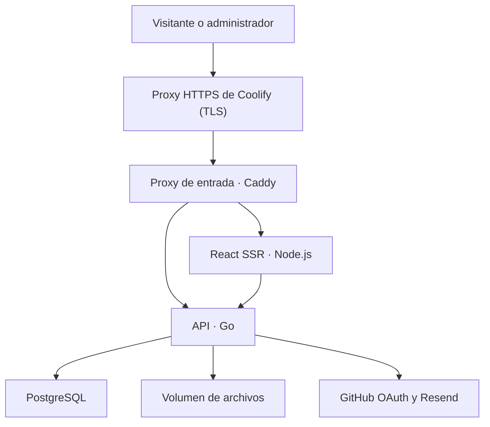

# BrambiLab Web v1 — Especificación técnica
Fecha: 2026-09-27 · Zona editorial: America/Mexico_City
Estado: requisitos acordados con Gustavo; diseño técnico listo para implementación, aún no implementado.
Responsable funcional: Gustavo. Decisión de stack: [ADR-006](ADR-006-web-stack.md).

## 1. Objetivo y alcance
Publicar el proceso de construcción de proyectos desde sus primeros experimentos. Inicio como portafolio profesional; fichas como laboratorio técnico. La web se construye ahora y no depende de terminar BL-001.
Incluye proyectos, bitácora por proyecto, artículos independientes, medios y recursos descargables, búsqueda y filtros, español/inglés, SEO y contacto.
Panel privado de un único administrador mediante GitHub. Visitantes sin registro, comentarios ni aportaciones.
Fuera de v1: pagos, comunidad, traducción automática, transcodificación de video, MCP, sincronización bidireccional Git/CMS y administración multiusuario.

## 2. Requisitos acordados
| Área | Decisión |
|---|---|
| Frontend | React + TypeScript; Tailwind CSS |
| Renderizado | SSR público mediante Node.js; API y negocio exclusivamente en Go |
| Datos | PostgreSQL |
| Infraestructura | Docker y Coolify; VPS Hostinger KVM 2 exclusivo |
| Edición | Editor visual e importación/exportación Markdown |
| Publicación | Borradores, vista previa, publicación manual y programada |
| Revisiones | Editar borrador conservando la versión pública hasta publicar |
| Idiomas | Interfaz i18n; contenido español/inglés traducido manualmente |
| Acceso | GitHub OAuth, restringido al ID del propietario |
| Medios | Archivos locales persistentes; interfaz preparada para S3 |
| Video | MP4 preparado por el autor, portada manual y enlaces YouTube |
| Descargas | Administrador decide qué archivos son públicos y descargables |
| Descubrimiento | Texto + categoría + etiqueta + tipo; idioma seleccionado |
| Contacto | Correo/LinkedIn/GitHub y formulario mediante Resend |
| Respaldos | Destino externo pendiente antes de lanzamiento |

## 3. Componentes y responsabilidades
Propuesta de implementación: React Router en modo framework con SSR para evitar crear un servidor de renderizado propio. Es una elección técnica de esta especificación; no cambia el stack acordado. Fijar versiones compatibles en lockfile y go.mod al iniciar; no se prescriben versiones no comprobadas.

- web: páginas React públicas y panel /admin; consulta API interna para SSR. Sin credenciales PostgreSQL, reglas de publicación ni implementación paralela de autenticación.
- api: monolito modular Go: auth, content, publishing, media, search, contact. Único dueño de PostgreSQL, autorización y validación.
- postgres: datos editoriales, revisiones, sesiones y trabajos durables.
- Scheduler y envío pendiente: bucles en el proceso Go inicial, con trabajos en PostgreSQL, ejecución acotada y locks transaccionales. No Redis ni contenedor worker obligatorio en v1. Extraer worker si la carga lo justifica.
- Proxy de Coolify termina TLS y entrega todo el dominio al servicio proxy (Caddy, platform/proxy), única entrada pública: /api/v1/* y /media/* a Go; resto a web. Decisión de Gustavo del 2026-09-27 en WEB-002, frente al enrutado por ruta en Coolify, para que el mismo origen sea idéntico en local, en CI y en el VPS. PostgreSQL, API y web sin puerto público. SSR usa dirección privada http://api:8080.
- Una sola instancia de API al inicio; la cola debe tolerar reinicios y futuras instancias sin publicar dos veces.

## 4. Estructura de código prevista
- platform/web/: React, rutas públicas/admin, i18n, componentes, editor y Dockerfile.
- platform/api/: cmd/server, internal/{auth,content,publishing,media,search,contact,jobs}, migrations y Dockerfile.
- platform/compose.yaml: proxy, web, api, postgres y migrate; volúmenes y healthchecks. compose.e2e.yaml añade un GitHub simulado sólo para pruebas.
- platform/contracts/openapi.yaml: contrato versionado de API y tipos TS generables.
- docs/architecture/: decisiones y diseño.
Estas rutas describen entregables futuros; esta entrega no crea servicios ejecutables.

## 5. Fuentes de verdad
GitHub conserva código, especificaciones, decisiones, tareas y documentación de ingeniería reproducible.
PostgreSQL es la fuente de verdad del contenido editorial del panel; volumen local contiene bytes de medios. La web no lee documentos de Git en cada petición.
Importar Markdown es una acción explícita que crea/actualiza un borrador; exportar crea un snapshot portable. No sobrescribir publicaciones al hacer git push.
Los documentos de projects/ pueden respaldar artículos mediante enlaces; no mantener copias editorialmente sincronizadas a mano. No mover secretos o archivos privados a Git.
Desplegar código y publicar contenido son operaciones distintas.

## 6. Modelo de datos lógico
UUID internos; timestamps timestamptz UTC; FK, restricciones y migraciones SQL.
| Entidad | Campos y reglas principales |
|---|---|
| contents | id, kind project/article/log, project_id obligatorio sólo para log, created_at, archived_at |
| translations | id, content_id, locale es/en, published_revision_id nullable; UNIQUE(content_id,locale) |
| revisions | id, translation_id, version, title, slug, summary, body_json, body_schema_version, plain_text, seo, cover_asset_id, project_fields, created_at |
| revision_taxonomy | revision_id + category/tag; versionar relaciones para que editar filtros no cambie lo público prematuramente |
| categories/tags | identidad estable y etiquetas localizadas |
| revision_assets | revision_id, asset_id, uso embed/download; referencias de portada incluidas |
| publication_jobs | translation_id, revision_id, run_at, estado, intentos; publicación programada apunta a una revisión inmutable |
| assets | id, storage_backend, object_key, original_name, mime, size, sha256, estado, public_enabled, downloadable, created_at |
| asset_translations | asset_id, locale, alt_text, caption |
| sessions | hash del token, github_user_id, expiry, revoked_at |
| contact_messages/jobs | envío, estado, intentos, próxima ejecución, idempotency_key |
| slug_history | locale, ruta anterior y destino; redirección tras publicar cambio de slug |
| audit_events | actor, acción, entidad, fecha; nunca tokens ni cuerpo de mensajes |

Cada guardado genera revisión inmutable o snapshot versionado equivalente. published_revision_id sólo cambia al publicar. La API exige versión esperada/If-Match; conflicto devuelve 409 y conserva trabajo.
project_fields contiene objetivo, estado (idea/en desarrollo/pausado/completado), tecnologías, enlaces de repositorio y resultados. Su estado técnico es distinto del estado editorial.
Un log sólo es público si el proyecto padre tiene versión publicada en el mismo idioma. No permitir retirar un proyecto con logs públicos sin resolver explícitamente esa dependencia.
Unicidad del slug público por idioma y tipo/ruta; detectar conflictos también al ejecutar programación.
Retener revisiones en v1; su política de purga se definirá después. No borrar archivos todavía referenciados.

## 7. Edición y Markdown
Documento estructurado JSON validado como formato canónico; no HTML arbitrario como fuente confiable. Implementación concreta del editor por seleccionar en WEB-003 con prueba de compatibilidad.
Bloques v1: títulos, párrafos, énfasis, listas, enlaces, citas, código con lenguaje, tablas simples, imágenes con alt, video MP4, YouTube y descarga de archivo.
Importación/exportación de Markdown del subconjunto soportado. Usar enlaces estables /media/{id} para medios; portabilidad completa requiere exportar los archivos junto al Markdown.
Embeds personalizados usan directivas documentadas (por ejemplo :::youtube, :::video, :::download) y esquema versionado. Advertir sobre sintaxis no soportada antes de importar; nunca perder bloques silenciosamente.
Cambiar de editor no debe descartar contenido. Importaciones remotas no descargan URLs arbitrarias desde el servidor. HTML/iframe libre deshabilitado; YouTube mediante ID/URL validada.
Pegar imágenes crea assets privados; texto alternativo y portada se editan en el panel.
Prueba de salida: visual → Markdown → importación conserva semántica de todos los bloques soportados. No prometer compatibilidad universal con cualquier Markdown.

## 8. Publicación y programación
Por traducción: sin publicar, publicada, retirada. El borrador/revisión nueva puede coexistir con una publicación; la programación es un job separado.
1. Guardar crea revisión privada.
2. Vista previa requiere sesión del propietario, no-store y noindex.
3. Publicar valida contenido, slugs, medios y padre; cambia puntero público en una transacción.
4. Programar congela revision_id y convierte fecha local de America/Mexico_City a UTC.
5. Editar después no modifica la revisión programada: panel permite reemplazar o cancelar explícitamente.
6. Job reclama registros vencidos con bloqueo; publica atómicamente y registra resultado. Tras reinicio recupera vencidos; errores reintentables con backoff y límite, errores de validación visibles sin reintento infinito.
7. Retirar cancela jobs de esa traducción y excluye contenido de API pública, sitemap, búsqueda y rutas. Re-publicar requiere acción explícita.
Objetivo inicial: ejecutar dentro de 60 segundos del horario mientras servicio/DB estén saludables; mostrar retrasos/fallos en panel.
Primera versión sin caché compartida de HTML/contenido: no-store para evitar borradores expuestos y publicación obsoleta. Assets estáticos versionados sí pueden cachearse. Optimizar con invalidación más adelante.

## 9. Rutas, idiomas, SEO y navegación
| Español | Inglés |
|---|---|
| /es | /en |
| /es/proyectos | /en/projects |
| /es/proyectos/:slug | /en/projects/:slug |
| /es/proyectos/:projectSlug/bitacora/:slug | /en/projects/:projectSlug/log/:slug |
| /es/articulos/:slug | /en/articles/:slug |
| /es/buscar | /en/search |
| /es/acerca-de y /es/contacto | /en/about y /en/contact |

/ redirige a /es como idioma por defecto inicial. Selector enlaza traducción publicada equivalente; si falta, indica que no está disponible y ofrece el índice del otro idioma, sin fingir traducción.
Admin /admin y login privado; interfaz inicial española con catálogo i18n preparado.
HTML SSR incluye título, texto, canonical absoluto, descripción, Open Graph, imagen pública y hreflang sólo de traducciones publicadas. Sitemap sólo con rutas canónicas públicas; robots/noindex para admin, previews y resultados de búsqueda.
Slugs editables por idioma; cambio publicado conserva redirect permanente evitando cadenas/bucles.
Diseño adaptable a móvil, navegación por teclado, contraste legible, alt de imágenes y formularios etiquetados.
Homepage: presentación, proyectos destacados, últimos avances, artículos y contacto. Panel administra también bio, enlaces y selección de destacados.
La identidad visual utiliza assets aprobados por Gustavo; no inventar un logo definitivo ni sustituirlo por un render.

## 10. API REST inicial
Prefijo /api/v1; JSON, paginación y errores {code,message,fields,request_id}. Contrato en OpenAPI.
| Grupo | Operaciones previstas |
|---|---|
| Público | GET /projects, /articles, /logs, /search, /site; filtros locale, category, tag, type y paginación |
| Detalle | GET /content/{kind}/{slug}?locale=es; sólo revisión publicada y padre visible |
| Autenticación | GET /auth/github/start, /auth/github/callback, /auth/me; POST /auth/logout |
| Administración | CRUD /admin/contents y /admin/contents/{id}/translations/{locale}/revisions |
| Publicación | POST publish/schedule/withdraw sobre traducción; DELETE schedule; GET revisions y preview |
| Medios | POST /admin/assets; PATCH metadatos/permisos; DELETE sólo sin referencias; GET /media/{id} y /media/{id}/download |
| Contacto | POST /contact, sin archivos adjuntos; respuesta 202 cuando se guarda para envío |
| Operación | GET /health/live y /health/ready |

Rutas exactas se congelan al crear OpenAPI antes de implementar frontend/backend en paralelo. Ninguna operación admin se autoriza por ocultar botones.
Búsqueda propuesta: PostgreSQL full-text con configuración español/inglés y GIN; índice derivado exclusivamente de revisión publicada. Actualizar en transacción de publicación/retirada. Sin Elasticsearch en v1.
Pruebas incluyen filtros combinados, idioma y ausencia de títulos/fragmentos de borradores.

## 11. GitHub OAuth y sesiones
Go inicia flujo Authorization Code, state aleatorio de un solo uso y PKCE; callback fijo y validado. Tras identidad GitHub, comparar ID numérico con ADMIN_GITHUB_USER_ID, nunca sólo nombre o correo. No crear usuarios por aceptación de OAuth.
No solicitar permisos de repositorios: autenticación de identidad solamente. No exponer client secret/token al navegador.
Sesión propia opaca, token aleatorio hasheado en DB; cookie Secure, HttpOnly, SameSite=Lax y Path=/. Expiración y revocación, logout servidor. Propuesta de duración: 12 horas, configurable.
CSRF y validación Origin para mutaciones; CORS mismo origen por defecto. Sanitización/validación de contenido, límites y consultas parametrizadas.
Secretos exclusivamente en Coolify; .env.example sin valores reales.

## 12. Archivos, video y migración S3
Interfaz Go Storage: Put, Open/ReadRange, Stat, Delete. Backend local primero; key opaca sin rutas basadas en nombre enviado. DB separa provider/key de URL pública estable.
Volumen /data/media separado de imagen Docker. Subida streaming a temporal, límite de bytes, comprobación MIME/firma y escritura final atómica; estados pending/ready/failed. Limpiar temporales huérfanos.
Regla pública: asset ready + public_enabled + referencia desde revisión publicada visible. downloadable exige además bandera explícita. Sin publicación, sólo acceso autenticado. Retirar contenido elimina acceso si no queda otra referencia pública.
Go sirve medios comprobando reglas; volumen no se expone como directorio estático. Soportar HEAD y Range/206 para MP4 y 416 en rangos inválidos. Descargar documentos con Content-Disposition attachment y nosniff.
Limites iniciales propuestos y configurables: imagen 20 MiB, documento/recurso 100 MiB, MP4 250 MiB; 1 subida grande concurrente. Alinear límites/timeouts de proxy y API; comprobar espacio antes de aceptar.
MP4 con codecs preparados compatibles con navegadores objetivo; no asumir que toda extensión .mp4 reproduce. Sin FFmpeg, HLS ni conversiones de video automáticas en v1. Portada manual y YouTube con dominio/ID permitido; carga del embed al interactuar.
Imágenes: quitar EXIF antes de hacerlas públicas y controlar dimensiones; SVG/HTML ejecutables no se muestran inline. Recursos ZIP/STL se entregan como descarga; no descomprimirlos en servidor.
Migración futura: copiar bytes a S3, verificar hash/tamaño, cambiar provider/key por lotes y conservar volumen anterior hasta validar. No cambiar URLs /media/{id}; adaptador decide stream o entrega autorizada. Ningún bucket público para borradores.
Límite de disco y alertas por ocupación; seleccionar umbral al verificar capacidad real.

## 13. Contacto y Resend
Enlaces configurables a correo, LinkedIn y GitHub. Formulario nombre, correo y mensaje, sin adjuntos.
Go valida tamaños/formato, aplica honeypot y rate limit; guarda job antes de responder 202. Remitente desde dominio verificado en Resend; correo del visitante sólo Reply-To; destinatario fijo configurable, nunca arbitrario.
Reintentos limitados con backoff e idempotency key estable. Panel muestra pendientes/fallidos y permite reintento consciente; no indicar «entregado» sólo por aceptación de API.
Evitar guardar el texto completo en logs. Retención propuesta de mensajes: 30 días; informar uso del formulario en aviso de privacidad.
Antes de habilitar: dominio remitente, destinatario y API key configurados; sin configuración, formulario deshabilitado con enlaces alternativos. No enviar correos reales como parte de esta especificación.

## 14. Docker y Coolify
Cuatro servicios runtime: proxy, web, api y postgres, más la tarea migrate. Build multietapa, usuario no-root donde corresponda, imágenes versionadas y dependencias fijadas; sin montar código fuente en producción.
Volúmenes postgres_data y media_data persistentes. Red interna para DB/API; exposición pública sólo por proxy. Healthchecks y reintentos de conexión; readiness comprueba dependencias sin filtrar credenciales.
Migraciones como tarea de release antes de activar nueva API; un ejecutor con lock. Cambios compatibles hacia adelante; no ejecutar rollback destructivo automáticamente.
Configuración: PUBLIC_ORIGIN, INTERNAL_API_URL, DATABASE_URL, ADMIN_GITHUB_USER_ID, GITHUB_CLIENT_ID/SECRET, SESSION_SECRET si se requiere firma, RESEND_API_KEY, CONTACT_FROM/TO, STORAGE_DRIVER, STORAGE_LOCAL_ROOT, upload limits y TZ editorial.
Dominio final y callbacks pendientes. No asumir capacidad exacta de KVM 2: verificar RAM/CPU/disco en panel antes de fijar límites. Ajustar pool DB, concurrencia y memoria mediante prueba de carga; no prometer tráfico soportado.
CI prevista: lint/typecheck/build frontend; go vet/test/build; integración PostgreSQL; migraciones; construcción Docker. Despliegue mediante Coolify desde rama acordada con autorización, no despliegue automático en esta entrega.

## 15. Operación y respaldos
Logs estructurados con request_id; métricas de latencia, errores, jobs atrasados, disco y fallos de contacto. No registrar tokens, cuerpos privados ni datos sensibles innecesarios.
Backups: PostgreSQL + bytes media + configuración necesaria, cifrados fuera del VPS. Destino, frecuencia, retención y objetivos RPO/RTO pendientes de elección antes de lanzamiento.
Diseñar copia consistente: congelar borrados/cambios destructivos o snapshot coordinado, registrar manifiesto de objetos y verificar referencias DB. Un volumen persistente no es un backup.
Gate de lanzamiento: restaurar DB y archivos en entorno separado y comprobar login, referencias y publicaciones. Proveedor pendiente no bloquea desarrollo.

## 16. Entregas y aceptación
| Tarea | Resultado verificable |
|---|---|
| WEB-001 | Scaffold React SSR/Go/Postgres, Compose, healthchecks, OpenAPI base, migraciones reproducibles |
| WEB-002 | OAuth sólo propietario; sesión/cierre; otra cuenta rechazada; CSRF probado |
| WEB-003 | Proyectos/artículos/logs, traducciones, revisiones y editor; round-trip Markdown probado |
| WEB-004 | Medios locales privados/públicos, descargas y MP4 con Range; límites y EXIF verificados |
| WEB-005 | Publicar/programar/retirar; job sobrevive reinicio; revisión nueva no altera contenido público |
| WEB-006 | Portafolio, fichas, bitácoras, i18n, SSR, SEO, búsqueda y filtros sólo públicos |
| WEB-007 | Contacto Resend con proveedor simulado en tests; configuración real y envío de prueba autorizado |
| WEB-008 | Coolify, configuración final, backup/restauración y prueba integral previa al lanzamiento |

Pruebas críticas: acceder sin sesión a preview/asset privado devuelve rechazo; cuenta GitHub distinta rechazada; dos ediciones detectan conflicto; programación publica revisión congelada; retirada elimina búsqueda/sitemap/medios sin otras referencias; HTML sin JS contiene contenido y metadatos; traducción faltante no produce página ficticia; redespliegue preserva DB/archivos; descargas y video no cargan archivos completos en RAM.
Orden: WEB-001 → WEB-002 → WEB-003 → WEB-004 → WEB-005 → WEB-006 → WEB-007 → WEB-008. Sin condicionar web a movimiento del rover.

## 17. Contenido inicial y pendientes
BL-001 servirá como primer proyecto en desarrollo. Datos reportados en conversación: cámara funcionó alimentada por USB; dos baterías de 3.7 V disponibles sin prueba con ellas; motores sin prueba reportada. Identificación visual del driver probable L298N, sin referencia del chip confirmada. No convertirlos en mediciones verificadas ni declarar inventario cerrado.
Esta entrega no modifica las fichas físicas ni publica archivos del fabricante. Importación editorial posterior con referencia al origen y revisión de recursos.

Pendientes operativos: dominio/callback OAuth, ID administrador configurado, recursos exactos del VPS, datos Resend, destino/política de backup. Pendientes de implementación: editor y formato de directivas final, versiones de dependencias y calibración de límites. Ninguno debe presentarse como servicio ya desplegado.

## 18. Referencias técnicas
Consultadas 2026-09-27; son soporte de las elecciones, no pruebas de implementación:
- [React Router: estrategias de renderizado](https://reactrouter.com/start/framework/rendering): SSR como modo soportado para React.
- [GitHub OAuth](https://docs.github.com/en/apps/oauth-apps/building-oauth-apps/authorizing-oauth-apps): Authorization Code, state y PKCE.
- [Resend: idempotency keys](https://resend.com/docs/dashboard/emails/idempotency-keys): controlar reintentos de envío.
