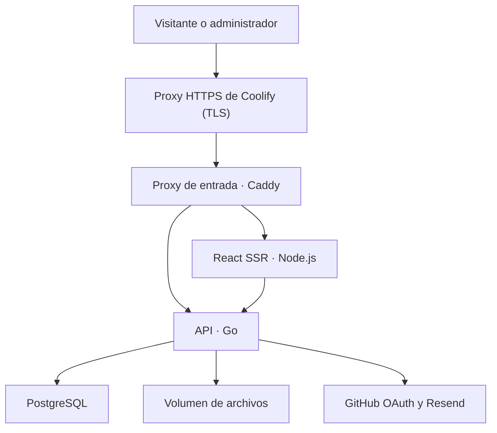

# BrambiLab Web v1 — Especificación técnica
Fecha: 2026-09-27 · Zona editorial: America/Mexico_City
Estado: requisitos acordados con Gustavo; diseño técnico listo para implementación, aún no implementado.
Responsable funcional: Gustavo. Decisión de stack: [ADR-006](ADR-006-web-stack.md).

## 1. Objetivo y alcance
Publicar el proceso de construcción de proyectos desde sus primeros experimentos. Inicio como portafolio profesional; fichas como laboratorio técnico. La web se construye ahora y no depende de terminar BL-001.
Incluye proyectos, bitácora por proyecto, artículos independientes, medios y recursos descargables, búsqueda y filtros, español/inglés, SEO y contacto.
Panel privado de un único administrador mediante GitHub. Visitantes sin registro, comentarios ni aportaciones.
Fuera de v1: pagos, comunidad, traducción automática, transcodificación de video, MCP, sincronización bidireccional Git/CMS y administración multiusuario.

## 2. Requisitos acordados
| Área | Decisión |
|---|---|
| Frontend | React + TypeScript; Tailwind CSS |
| Renderizado | SSR público mediante Node.js; API y negocio exclusivamente en Go |
| Datos | PostgreSQL |
| Infraestructura | Docker y Coolify; VPS Hostinger KVM 2 exclusivo |
| Edición | Editor visual e importación/exportación Markdown |
| Publicación | Borradores, vista previa, publicación manual y programada |
| Revisiones | Editar borrador conservando la versión pública hasta publicar |
| Idiomas | Interfaz i18n; contenido español/inglés traducido manualmente |
| Acceso | GitHub OAuth, restringido al ID del propietario |
| Medios | Archivos locales persistentes; interfaz preparada para S3 |
| Video | MP4 preparado por el autor, portada manual y enlaces YouTube |
| Descargas | Administrador decide qué archivos son públicos y descargables |
| Descubrimiento | Texto + categoría + etiqueta + tipo; idioma seleccionado |
| Contacto | Correo/LinkedIn/GitHub y formulario mediante Resend |
| Respaldos | Destino externo pendiente antes de lanzamiento |

## 3. Componentes y responsabilidades
Propuesta de implementación: React Router en modo framework con SSR para evitar crear un servidor de renderizado propio. Es una elección técnica de esta especificación; no cambia el stack acordado. Fijar versiones compatibles en lockfile y go.mod al iniciar; no se prescriben versiones no comprobadas.



- web: páginas React públicas y panel /admin; consulta API interna para SSR. Sin credenciales PostgreSQL, reglas de publicación ni implementación paralela de autenticación.
- api: monolito modular Go: auth, content, publishing, media, search, contact. Único dueño de PostgreSQL, autorización y validación.
- postgres: datos editoriales, revisiones, sesiones y trabajos durables.
- Scheduler y envío pendiente: bucles en el proceso Go inicial, con trabajos en PostgreSQL, ejecución acotada y locks transaccionales. No Redis ni contenedor worker obligatorio en v1. Extraer worker si la carga lo justifica.
- Proxy de Coolify termina TLS y entrega todo el dominio al servicio proxy (Caddy, platform/proxy), única entrada pública: /api/v1/* y /media/* a Go; resto a web. Decisión de Gustavo del 2026-09-27 en WEB-002, frente al enrutado por ruta en Coolify, para que el mismo origen sea idéntico en local, en CI y en el VPS. PostgreSQL, API y web sin puerto público. SSR usa dirección privada http://api:8080.
- Una sola instancia de API al inicio; la cola debe tolerar reinicios y futuras instancias sin publicar dos veces.

## 4. Estructura de código prevista
- platform/web/: React, rutas públicas/admin, i18n, componentes, editor y Dockerfile.
- platform/api/: cmd/server, internal/{auth,content,publishing,media,search,contact,jobs}, migrations y Dockerfile.
- platform/compose.yaml: proxy, web, api, postgres y migrate; volúmenes y healthchecks. compose.e2e.yaml añade un GitHub simulado sólo para pruebas.
- platform/contracts/openapi.yaml: contrato versionado de API y tipos TS generables.
- docs/architecture/: decisiones y diseño.
Estas rutas describen entregables futuros; esta entrega no crea servicios ejecutables.

## 5. Fuentes de verdad
GitHub conserva código, especificaciones, decisiones, tareas y documentación de ingeniería reproducible.
PostgreSQL es la fuente de verdad del contenido editorial del panel; volumen local contiene bytes de medios. La web no lee documentos de Git en cada petición.
Importar Markdown es una acción explícita que crea/actualiza un borrador; exportar crea un snapshot portable. No sobrescribir publicaciones al hacer git push.
Los documentos de projects/ pueden respaldar artículos mediante enlaces; no mantener copias editorialmente sincronizadas a mano. No mover secretos o archivos privados a Git.
Desplegar código y publicar contenido son operaciones distintas.

## 6. Modelo de datos lógico
UUID internos; timestamps timestamptz UTC; FK, restricciones y migraciones SQL.
| Entidad | Campos y reglas principales |
|---|---|
| contents | id, kind project/article/log, project_id obligatorio sólo para log, created_at, archived_at |
| translations | id, content_id, locale es/en, published_revision_id nullable; UNIQUE(content_id,locale) |
| revisions | id, translation_id, version, title, slug, summary, body_json, body_schema_version, plain_text, seo, cover_asset_id, project_fields, created_at |
| revision_taxonomy | revision_id + category/tag; versionar relaciones para que editar filtros no cambie lo público prematuramente |
| categories/tags | identidad estable y etiquetas localizadas |
| revision_assets | revision_id, asset_id, uso embed/download; referencias de portada incluidas |
| publication_jobs | translation_id, revision_id, run_at, estado, intentos; publicación programada apunta a una revisión inmutable |
| assets | id, storage_backend, object_key, original_name, mime, size, sha256, estado, public_enabled, downloadable, created_at |
| asset_translations | asset_id, locale, alt_text, caption |
| sessions | hash del token, github_user_id, expiry, revoked_at |
| contact_messages/jobs | envío, estado, intentos, próxima ejecución, idempotency_key |
| slug_history | locale, ruta anterior y destino; redirección tras publicar cambio de slug |
| audit_events | actor, acción, entidad, fecha; nunca tokens ni cuerpo de mensajes |

Cada guardado genera revisión inmutable o snapshot versionado equivalente. published_revision_id sólo cambia al publicar. La API exige versión esperada/If-Match; conflicto devuelve 409 y conserva trabajo.
project_fields contiene objetivo, estado (idea/en desarrollo/pausado/completado), tecnologías, enlaces de repositorio y resultados. Su estado técnico es distinto del estado editorial.
Un log sólo es público si el proyecto padre tiene versión publicada en el mismo idioma. No permitir retirar un proyecto con logs públicos sin resolver explícitamente esa dependencia.
Unicidad del slug público por idioma y tipo/ruta; detectar conflictos también al ejecutar programación.
Retener revisiones en v1; su política de purga se definirá después. No borrar archivos todavía referenciados.

### 6.1 Implementación WEB-003
- `translations.latest_version` avanza de forma atómica con cada revisión. `published_revision_id` tiene una FK compuesta `(published_revision_id, id) → revisions(id, translation_id)`, así que no puede apuntar a una revisión de otra traducción. Ninguna operación de WEB-003 lo modifica; es de WEB-005.
- La revisión guarda el snapshot completo: título, slug, resumen, cuerpo, SEO, campos de proyecto, categoría (una, opcional) y etiquetas (varias). Las etiquetas se relacionan por revisión, así que editar la taxonomía no cambia versiones anteriores. Las categorías y etiquetas tienen una identidad estable y etiquetas es/en.
- Tipos de revisión: `manual`, `auto`, `restore` (con `restored_from_version`) y `copy` (borrador copiado de otro idioma, marcado como pendiente de traducir, nunca como traducción terminada).
- Archivar conserva el historial y se rechaza con 409 si alguna traducción está publicada. No hay borrado físico.
- Un log exige un proyecto padre existente, no archivado y de tipo project. El tipo y el padre no cambian después de crear el contenido.

### 6.2 Guardado y conflictos (decisión WEB-003)
Cada guardado exitoso, manual o automático, crea un snapshot inmutable completo.
- **Autoguardado:** tras 3 s de inactividad y sólo si hubo cambios; como máximo uno cada 15 s y una sola petición en vuelo por traducción. Los cambios hechos durante una petición quedan pendientes para el siguiente snapshot; una respuesta antigua no los marca como guardados. «Guardar revisión» persiste de inmediato y se serializa con los autoguardados pendientes.
- **Duplicados:** Go calcula un SHA-256 sobre el JSON canónico del snapshot. Si coincide con la última revisión, responde 200 `created: false` sin crear otra. La cabecera `Idempotency-Key` hace que el reintento de una misma operación devuelva la misma revisión.
- **Concurrencia:** `expected_version` es obligatorio. La comprobación y la inserción son atómicas (`UPDATE … WHERE latest_version = $expected`). Un conflicto responde 409 con la versión actual; el cliente conserva su buffer y ofrece recargar (tras confirmar el descarte) o exportar su trabajo local. Nunca reintenta con la versión del otro editor.
- **Estados visibles:** «Cambios sin guardar», «Guardando», «Guardado», «Error» y «Conflicto». Hay aviso al salir o al cambiar de idioma con cambios pendientes. Al recargar se recupera la última revisión guardada; no hay modo offline.
- **Restaurar** crea una revisión nueva (`restore`) y nunca modifica el original. El historial es paginado y distingue manual, automática, restauración y copia. Sin purga en v1.

## 7. Edición y Markdown
Documento estructurado JSON validado como formato canónico; no HTML arbitrario como fuente confiable. Implementación concreta del editor por seleccionar en WEB-003 con prueba de compatibilidad.
Bloques v1: títulos, párrafos, énfasis, listas, enlaces, citas, código con lenguaje, tablas simples, imágenes con alt, video MP4, YouTube y descarga de archivo.
Importación/exportación de Markdown del subconjunto soportado. Usar enlaces estables /media/{id} para medios; portabilidad completa requiere exportar los archivos junto al Markdown.
Embeds personalizados usan directivas documentadas (por ejemplo :::youtube, :::video, :::download) y esquema versionado. Advertir sobre sintaxis no soportada antes de importar; nunca perder bloques silenciosamente.
Cambiar de editor no debe descartar contenido. Importaciones remotas no descargan URLs arbitrarias desde el servidor. HTML/iframe libre deshabilitado; YouTube mediante ID/URL validada.
Pegar imágenes crea assets privados; texto alternativo y portada se editan en el panel.
Prueba de salida: visual → Markdown → importación conserva semántica de todos los bloques soportados. No prometer compatibilidad universal con cualquier Markdown.

### 7.1 Formato canónico v1 (WEB-003)
El formato canónico es un esquema JSON propio (`body_schema_version: 1`), no el JSON interno del editor. Un adaptador en el cliente convierte entre Tiptap y el formato canónico en ambos sentidos. Go valida de forma estricta y rechaza nodos, marcas o atributos desconocidos, aunque el documento haya pasado por el editor.
- **Bloques:** `paragraph`, `heading` (niveles 2 a 4; el título va aparte), `bulletList`, `orderedList` (`start`), `listItem`, `blockquote`, `codeBlock` (`language`, texto sin marcas), `horizontalRule`, `table`/`tableRow`/`tableHeader`/`tableCell` (tablas simples: cada celda es un párrafo, sin fusiones) y `youtube` (`videoId` de 11 caracteres validado, `start` opcional).
- **En línea:** `text` con las marcas `bold`, `italic`, `code` y `link` (`href`), y `hardBreak`.
- **Enlaces:** se aceptan `http`, `https`, `mailto`, rutas relativas `/…` y anclas `#…`. Se rechazan `javascript:`, `data:`, `vbscript:` y cualquier otro esquema. No hay HTML ni iframes.
- **Medios preparados para WEB-004:** `image` (`assetId`, `alt`, `caption`), `video` (`assetId`, `posterAssetId`, `caption`) y `download` (`assetId`, `label`). Desde WEB-004, la API sólo los acepta si el asset existe, está `ready` y es del tipo correcto (el póster y la portada, imágenes). Si no, responde 422 con el motivo. No se generan IDs ficticios.
- **Límites:** petición de 1 MiB como máximo, profundidad 32, 20 000 nodos y 200 000 caracteres de texto. Título de 200 caracteres, slug de 120 (`a-z0-9-`), resumen de 500, SEO de 70 y 160, y 20 etiquetas.

**Editor y Markdown (WEB-003, parte 2).**
- **Prueba previa (2026-09-27):** la extensión oficial `@tiptap/markdown` 3.31.3, en beta, no superó el fixture de prueba:
  1. no alargó el fence de un bloque de código que contenía ```` ``` ````, así que el documento quedó corrompido;
  2. exportó `\|` sin escapar dentro de una celda, con lo que la tabla ganó una columna;
  3. no entiende directivas;
  4. el JSON cambiaba en una segunda pasada.

  Por eso las conversiones son explícitas, sobre mdast (`mdast-util-from-markdown` y `mdast-util-to-markdown` con GFM tables y directivas, MIT), y trabajan con el formato canónico, no con Tiptap.
- **Dialecto:** CommonMark más tablas GFM, más directivas de hoja:
  - `::youtube{video=ID start=S}`
  - `::image{asset=UUID alt="…" caption="…"}`
  - `::video{asset=UUID poster=UUID caption="…"}`
  - `::download{asset=UUID label="…"}`

  Exportación con `-` en viñetas, `*` en énfasis, fences con ```` ` ```` (alargados cuando hace falta), escape de caracteres especiales y espacios de borde como `&#x20;`. Los párrafos vacíos, que sólo dan espaciado, no se exportan.
- **Importación:** nunca descarga URLs y nunca descarta contenido en silencio; todo lo no soportado se conserva como texto literal con aviso. En concreto:
  - HTML, directivas desconocidas y `texto:con:dos-puntos`;
  - el título 1 pasa a 2 y los títulos 5 y 6 pasan a 4;
  - las imágenes se convierten en enlace con su texto alternativo;
  - los enlaces inseguros quedan como texto;
  - se omiten la alineación de tablas y los metadatos de los bloques de código.
- **Editor:** Tiptap 3.31.3 sólo en cliente (`immediatelyRender: false`), restringido al esquema v1. Un adaptador convierte a canónico y normaliza de forma explícita: una celda con varias líneas se une con espacios y la primera fila de una tabla pasa a encabezado. Rechaza las celdas combinadas. Los fixtures compartidos (`platform/contracts/fixtures/documents`) atan Go y TypeScript al mismo contrato.

## 8. Publicación y programación
Por traducción: sin publicar, publicada, retirada. El borrador/revisión nueva puede coexistir con una publicación; la programación es un job separado.
1. Guardar crea revisión privada.
2. Vista previa requiere sesión del propietario, no-store y noindex.
3. Publicar valida contenido, slugs, medios y padre; cambia puntero público en una transacción.
4. Programar congela revision_id y convierte fecha local de America/Mexico_City a UTC.
5. Editar después no modifica la revisión programada: panel permite reemplazar o cancelar explícitamente.
6. Job reclama registros vencidos con bloqueo; publica atómicamente y registra resultado. Tras reinicio recupera vencidos; errores reintentables con backoff y límite, errores de validación visibles sin reintento infinito.
7. Retirar cancela jobs de esa traducción y excluye contenido de API pública, sitemap, búsqueda y rutas. Re-publicar requiere acción explícita.
Objetivo inicial: ejecutar dentro de 60 segundos del horario mientras servicio/DB estén saludables; mostrar retrasos/fallos en panel.
Primera versión sin caché compartida de HTML/contenido: no-store para evitar borradores expuestos y publicación obsoleta. Assets estáticos versionados sí pueden cachearse. Optimizar con invalidación más adelante.

### 8.1 Implementación WEB-005 (#26)
**Estado por traducción.**
- *Sin publicar*, *publicada* (`published_revision_id`) o *retirada* (`withdrawn_at` sin puntero).
- `editorial_version` es distinto de `latest_version` y avanza con publicar, programar, reemplazar, cancelar, retirar, reintentar y cada resultado de un trabajo. Todas esas acciones exigen `expected_editorial_version` y responden 409 `editorial_conflict` con el estado actual. Guardar un borrador no lo toca.
- Todas aceptan `Idempotency-Key`: la misma clave con el mismo cuerpo devuelve la respuesta original; con otro cuerpo, 422. Se guardan en `editorial_requests`, en la misma transacción.

**Publicar** una revisión guardada elegida explícitamente, en una transacción. Se valida:
- el contenido y la traducción existen y no están archivados;
- la revisión es de esa traducción, y el título y el slug son válidos;
- los medios referenciados están `ready` y `public_enabled`, y las descargas además `downloadable`;
- la portada y el póster son imágenes;
- una bitácora tiene su proyecto publicado, no archivado y en el mismo idioma.

Los permisos de los medios no se activan solos: el error 422 `publish_blocked` enumera los archivos afectados. Publicar actualiza el puntero, las fechas, la ruta y la auditoría, **y cancela cualquier programación pendiente** de esa traducción. Repetir una publicación idéntica no cambia nada. Si algo falla, la publicación anterior queda intacta.

**Rutas** (`public_routes`, que hace de *slug_history*):
- **Unicidad** `(locale, scope, slug)` con restricción de base de datos. El ámbito es `project` o `article` por idioma, o `log:<content_id del proyecto>`.
- **Guardar un borrador no reserva ruta.** Publicar la marca como vigente, y los slugs anteriores del mismo contenido quedan como alias reservados que otro contenido no puede usar.
- **Un alias resuelve a la ruta vigente de su contenido** en un solo salto: sin cadenas ni bucles.
- Las bitácoras dependen de la identidad del proyecto, no de su slug, así que un cambio de slug del proyecto no rompe sus rutas.
- Una traducción retirada conserva sus rutas reservadas, pero no responde ni redirige: 404.

**Visibilidad única.** La vista `visible_translations` (publicada, contenido no archivado y, si es bitácora, proyecto publicado y no archivado en el mismo idioma) la usan los medios, el lector público y los futuros listados, buscador y sitemap.

**Lector público mínimo**, con `no-store`, sólo con revisiones publicadas visibles:
- `GET /api/v1/public/{locale}/projects/{slug}`;
- `GET /api/v1/public/{locale}/articles/{slug}`;
- `GET /api/v1/public/{locale}/projects/{projectSlug}/logs/{slug}`.

Un alias responde 301 con `Location` hacia la ruta vigente. El sitio público completo es WEB-006.

**Programar.**
- La fecha y hora se introducen en America/Mexico_City y el servidor las convierte a UTC con la zona IANA (`time/tzdata` embebido). Se rechaza una fecha pasada.
- La revisión queda **congelada**; se valida al programar y otra vez al ejecutar.
- Si una bitácora se programa y su proyecto aún no está publicado, se acepta si el proyecto tiene una programación que vence antes o a la misma hora.
- Un solo trabajo activo por traducción (índice único parcial). Reemplazarlo es explícito (`replace: true`).
- Cada intento queda en `publication_job_attempts`.

**Ejecución** (en el proceso Go, sin Redis ni worker separado):
- Cada 15 s se toman como máximo 10 trabajos vencidos.
- Cada uno se ejecuta en **una transacción**, en este orden de bloqueo: traducción del proyecto padre (`FOR SHARE`) → traducción (`FOR UPDATE`) → trabajo (`FOR UPDATE`) → validación → publicación → trabajo `succeeded`.
- No existe estado `running`: los bloqueos de fila hacen de lease.
  - Si el proceso cae antes del commit, todo se deshace y el trabajo se recupera.
  - Si cae después, el trabajo consta como hecho y no se repite.
  - Un segundo ejecutor espera y encuentra el trabajo resuelto.
- **Errores transitorios** (base de datos): backoff de 30 s × 2ⁿ, con un tope de 10 min y 5 intentos, y después `failed`.
- **Errores de validación:** `failed` terminal con la causa legible.
- Primero los proyectos y después las bitácoras de la misma hora. Si una bitácora vence cuando su proyecto aún tiene una programación pendiente (por ejemplo, en backoff), espera a ese trabajo sin gastar intentos. Si el proyecto ya no tiene programación ni publicación, la bitácora falla como terminal.
- Reintentar es explícito y revalida, conservando la revisión elegida. El trabajo vuelve a la cola para la siguiente pasada con un presupuesto nuevo de intentos, y el registro de intentos continúa su numeración.
- Al arrancar, la primera pasada es inmediata: recupera lo que venció con el proceso caído.
- **Objetivo:** ejecutar en menos de 60 s tras la hora con la API y la base sanas. El reloj es inyectable en las pruebas.

**Cancelar y retirar.**
- Cancelar no retira lo que ya está publicado.
- Retirar quita el puntero y cancela los trabajos activos en la misma transacción, conservando revisiones y archivos.
- Un proyecto con bitácoras publicadas en ese idioma no se puede retirar (409 con la lista). No hay cascada y el otro idioma no se toca.
- Archivar se rechaza mientras haya publicación o programación activa.
- Todas las operaciones siguen el mismo orden de bloqueo, así que un trabajo que ya empezó termina antes o encuentra la cancelación: **no hay resurrección**.
- Los medios dejan de servirse de forma anónima cuando desaparece su última referencia publicada y visible. La autorización se comprueba antes de cualquier 304, HEAD o Range.

## 9. Rutas, idiomas, SEO y navegación
| Español | Inglés |
|---|---|
| /es | /en |
| /es/proyectos | /en/projects |
| /es/proyectos/:slug | /en/projects/:slug |
| /es/proyectos/:projectSlug/bitacora/:slug | /en/projects/:projectSlug/log/:slug |
| /es/articulos/:slug | /en/articles/:slug |
| /es/buscar | /en/search |
| /es/acerca-de y /es/contacto | /en/about y /en/contact |

/ redirige a /es como idioma por defecto inicial. Selector enlaza traducción publicada equivalente; si falta, indica que no está disponible y ofrece el índice del otro idioma, sin fingir traducción.
Admin /admin y login privado; interfaz inicial española con catálogo i18n preparado.
HTML SSR incluye título, texto, canonical absoluto, descripción, Open Graph, imagen pública y hreflang sólo de traducciones publicadas. Sitemap sólo con rutas canónicas públicas; robots/noindex para admin, previews y resultados de búsqueda.
Slugs editables por idioma; cambio publicado conserva redirect permanente evitando cadenas/bucles.
Diseño adaptable a móvil, navegación por teclado, contraste legible, alt de imágenes y formularios etiquetados.
Homepage: presentación, proyectos destacados, últimos avances, artículos y contacto. Panel administra también bio, enlaces y selección de destacados.
La identidad visual utiliza assets aprobados por Gustavo; no inventar un logo definitivo ni sustituirlo por un render.
**Sitio público: dirección «ingeniería editorial»** (WEB-009, [#47](https://github.com/Codelab-ai-dev/brambiLab/issues/47); decidida por Gustavo el 2026-09-28). Sustituye a la dirección «cuaderno de laboratorio» y al hero «banco de pruebas vivo» en el sitio público; el panel privado conserva la anterior.
- Mezcla: 70 % ingeniería industrial, 20 % producto tecnológico, 10 % experimental. Prioridad: tipografía → composición → fotografía → información técnica → animación. Sin SaaS genérico, tarjetas flotantes repetidas, glassmorphism excesivo, gradientes morados ni efectos gaming.
- Color:
  - base navy profundo `#06111F` y hero y CTA en navy `#0A1E3F`;
  - secciones editoriales en papel `#F4F4F1`;
  - una sola banda cyan `#1EC8FF` con texto oscuro;
  - el cyan marca palabras clave, CTA, cifras, estado activo y foco.
  - El sitio público no sigue la preferencia clara/oscura del sistema: cada sección elige su superficie. No hay selector de tema.
- Tokens: los mismos nombres semánticos del panel se redefinen dentro de `.bl-site` y de las superficies `.bl-navy`, `.bl-light` y `.bl-signal` (`platform/web/app/app.css`), así el rediseño no llega al panel.
  - Contraste medido par a par, incluidos los tokens propios de la superficie clara (texto secundario `#4F5B6B`, enlace `#006A8E`), porque el gris `#8B98A8` (2,66:1) y el cyan (1,77:1) no sirven sobre papel.
  - Las líneas decorativas (cyan al 15 %) nunca sustituyen un borde de control ni el foco.
- Tipografía:
  - Space Grotesk variable (OFL, servida por el sitio) para titulares e interfaz, IBM Plex Mono para metadatos e IBM Plex Sans sólo para el texto largo (`.bl-prose`), porque Space Grotesk no tiene cursiva. Ancho de lectura de 34 em (≈ 70 caracteres por línea).
  - Titular del hero ajustado al ancho de su columna (unidades de contenedor) para que cada línea quepa entera; titulares de sección `clamp(2.5rem, 7vw, 8rem)`, con un mínimo inferior al del issue porque «Construyamos» mide 6,6 em.
  - Retícula de 12, 6 y 1 columnas, con marco de hasta 100rem. Radios de 0–4 px.
- Imágenes:
  - Las portadas en bloques editoriales se muestran desaturadas por CSS (el archivo conserva su color), con hover de hasta `scale(1.03)`. El detalle y el visor de #41 muestran el color real.
  - Sin foto propia autorizada, el hero y las áreas usan ilustraciones SVG originales, estáticas y marcadas como conceptuales. Nunca se usa el rover del mockup.
- Contenido: sólo datos del API público.
  - Sin proyectos, cifras, coordenadas, revisiones ni capacidades inventadas.
  - Los metadatos aparecen sólo si el campo existe.
  - La cifra de proyectos es el total público del idioma y sólo se muestra a partir de 3.
  - Las áreas se presentan como enfoque, no como proyectos.
- Accesibilidad (entrega 3): anillo de foco por defecto en todo elemento interactivo público; `e2e/a11y.pw.ts` ejecuta axe (WCAG 2.2 A/AA) en todas las rutas, recorre el foco con teclado y comprueba zoom y texto al 200 %. Complementa, no sustituye, la revisión con lector de pantalla.
- Movimiento ([#52](https://github.com/Codelab-ai-dev/brambiLab/issues/52)), mejora progresiva sobre HTML SSR completo. Duraciones, easing (ease-out sin rebote) y desplazamiento en tokens de `app.css` (`--motion-*`, `--ease-out`); sólo `transform` y `opacity`.
  - Hero: entrada por bloques (título, subtítulo, CTA, metadatos y visual) de 550 ms con desfase de 85 ms y 16 px como máximo (8 px en móvil). El título, que es el elemento LCP, sólo se desplaza y nunca es transparente. Un bloque enfocado deja de animarse.
  - Secciones (`data-reveal` y `useReveal`): sólo se ocultan las que siguen bajo el pliegue al hidratar, así no hay destello. Cada una aparece una vez y no se vuelve a ocultar. El foco de teclado la muestra al instante. Sin JavaScript, sin IntersectionObserver o con movimiento reducido, nada se oculta.
  - Fotos de bloques editoriales: zoom de 1 a 1,03 dentro de su marco, sólo con `hover: hover` o con el foco. Las flechas avanzan 4 px en 220 ms con hover y con foco, y el área clicable no se mueve. Enlaces y botones cambian de color en 220 ms.
  - Navegación: el fondo pasa de navy a navy profundo translúcido al salir del inicio de la página. Lo detecta un centinela observado, sin listener de scroll; la altura no cambia.
  - Visual técnico único ([#53](https://github.com/Codelab-ai-dev/brambiLab/issues/53), sustituye al pulso del relieve de #52, así nunca hay dos visuales protagonistas): una escena Three.js con React Three Fiber, una «nube de percepción» conceptual con anillos de barrido en el suelo, una caja, un pilar y un muro, y en cyan los anillos y el campo de visión del sensor.
    - Rotación lenta y respuesta leve al cursor; sin cifras, escaneos ni estados que aparenten datos reales.
    - El HTML SSR siempre trae la imagen estática: la misma nube proyectada con la misma cámara (`perception.ts`).
    - El *chunk* 3D (`HeroScene`, unos 236 KB comprimidos) se carga sólo en la home, tras el evento `load` y con el navegador ocioso. Requisitos: escritorio con puntero fino y hover, WebGL disponible (prueba de capacidad, no de user-agent), sin movimiento reducido y sin ahorro de datos. Móvil y táctil usan la imagen estática.
    - La imagen se mantiene hasta el primer fotograma y luego hay un fundido breve.
    - Un fallo de descarga o de render, o la pérdida del contexto WebGL, devuelven la imagen. Un error boundary aísla la escena del resto de la página.
    - Un canvas y un contexto, tres *draw calls*, DPR ≤ 1,5, sin posprocesado, sombras ni texturas.
    - El bucle (`frameloop`) sólo corre mientras se reproduce. Pausa y reanudación con botón ES/EN, y se detiene fuera de pantalla o con la pestaña oculta.
    - El canvas es `aria-hidden`, no enfocable y no recibe eventos de puntero.
    - Las versiones van fijadas: `three` 0.182.0 (la 0.183+ hace que R3F 9.8 emita en consola el aviso de `THREE.Clock` obsoleto).
  - Con `prefers-reduced-motion` todo muestra su estado final, incluso si la preferencia cambia durante la visita. Sin scroll hijacking, parallax, cursor propio ni librerías de animación.
- Páginas interiores (entrega 2):
  - cabecera navy con titular grande;
  - índices y búsqueda como filas editoriales (`<article>` con título enlazado, fecha, tipo, estado, tecnologías, términos y miniatura desaturada), con filtros GET y paginación;
  - el recuento de la cabecera es el total del API;
  - proyecto, artículo y bitácora: portada en color, a lo ancho y sin recorte (`object-contain`), texto sobre papel, ficha técnica del proyecto, bitácora y «Seguir explorando», sólo con destinos existentes (índice, proyecto de la bitácora y categoría);
  - acerca de y contacto sobre papel; el formulario desactivado sigue explicándolo.
- Navegación: cabecera fija translúcida, con el menú móvil como botón desplegable (`aria-expanded`; Escape cierra y devuelve el foco). Sin JavaScript, el mismo control enlaza a la navegación del pie. Los enlaces de perfil del pie son sólo los configurados.
- Logotipo modular (#45): tres piezas que forman una «b» y el texto «BrambiLab», del kit en `platform/web/public/brand/originals/` (copia sin modificar con `SHA256SUMS`).
  - Componente único `BrambiLabLogo` con los trazados del kit sin alterar, `viewBox` 1220×380 y altura fija: sin distorsión ni salto de layout. Es decorativo (`aria-hidden`); el enlace que lo contiene se llama «BrambiLab» y lleva a la portada del idioma.
  - Superficie clara: colores originales. Superficies navy: texto blanco y **variante óptica** del segmento #0A1E3F → #ECE7DC, porque el original desaparece sobre navy (1,0–1,15:1). Tokens `--logo-stem` y `--logo-ink`.
  - Favicon SVG con alternativa ICO y `apple-touch-icon`; sin manifest ni PWA.

**Panel privado: dirección «cuaderno de laboratorio»** (elegida por Gustavo el 2026-09-27):
- Fondo papel y texto tinta; ámbar como señal (enlaces, foco, estado activo) y tinta para las acciones principales. Modo oscuro en grafito con ámbar encendido, según el sistema.
- IBM Plex Sans para leer e IBM Plex Mono para datos, incluidas en el propio sitio (OFL). Retícula milimetrada decorativa en el login.
- Tokens semánticos en `@theme` de `platform/web/app/app.css`: contraste AA en texto y 3:1 en bordes de controles, comprobados par a par.

### 9.1 Implementación WEB-006 (#30)
**Una sola regla pública.**
- Todo lo público sale de `visible_translations` y de la revisión apuntada por `published_revision_id`. React/Node no decide visibilidad: SSR llama sólo a `/api/v1/public/*`, sin reenviar la cookie de sesión, así que el propietario ve lo mismo que un anónimo.
- Guardar o restaurar un borrador no toca ninguna superficie pública: tarjetas, detalle, búsqueda, taxonomía, contadores ni sitemap.

**Proyección de búsqueda** (`search_documents`, una fila por traducción publicada).
- La mantiene un trigger sobre `translations.published_revision_id`, así que se actualiza en la misma transacción al publicar (manual o programado), republicar o retirar. La migración hace el backfill.
- `search` = título (peso A) + resumen (B) + `plain_text` (C). Configuraciones `bl_es`/`bl_en` = spanish/english con `unaccent` («energia» encuentra «energía»), también en tokens con guion o dígitos («telemetría-2», «ESP32-C3»; migración 00007).
- Las consultas usan `websearch_to_tsquery` (texto libre, comillas y `-palabra`, sin sintaxis que falle) y **siempre** se cruzan con `visible_translations`: un índice obsoleto nunca basta para mostrar algo.
- Orden: `ts_rank_cd` descendente, luego `first_published_at` descendente y `content_id`. Consulta vacía, de más de 200 caracteres (422) o sin lexemas buscables (sólo signos o palabras vacías): respuesta `no_terms` sin resultados; los índices siguen en sus rutas.
- Fragmentos: `ts_headline` sobre `plain_text` sin caracteres de control, con marcadores de control propios; Go los convierte en segmentos `{text, hit}`. La web los pinta como texto (y `<mark>`), nunca como HTML.

**Listados y filtros.**
- `GET /public/{locale}/contents?kind&category&tag&project&page&page_size`: filtros combinados con AND (un tipo, una categoría, una etiqueta, un proyecto para bitácoras). `page_size` 1-50 (12 por defecto).
- Orden por `first_published_at` descendente y `content_id`. Paginación por desplazamiento: publicar o retirar entre páginas puede desplazar un elemento; se acepta y se documenta.
- Las tarjetas no llevan cuerpo: título, resumen, fechas, categoría, etiquetas, campos técnicos del proyecto (estado, tecnologías), proyecto padre de una bitácora y portada sólo si es pública.
- Taxonomía pública: categorías y etiquetas usadas por revisiones publicadas visibles en ese idioma (y tipo), con contadores. Un término usado sólo en borradores no aparece.

**Detalle.** Los lectores de WEB-005 añaden:
- `first_published_at`, categoría, etiquetas y `alternates` (la otra traducción visible, con su tipo y slugs vigentes);
- los metadatos de los medios servibles de forma anónima (`ready`, `public_enabled` y, para descargas, `downloadable`). Lo revocado se omite y la web lo muestra como no disponible.

**Configuración del sitio** (`site_settings`, fila única con `version`, y `site_featured_projects`).
- Presentación (inicio) y biografía (acerca de) en es/en, correo de contacto, enlaces (`github`, `linkedin`, `website` u `other`, sólo `https://`, 8 como máximo) y proyectos destacados ordenados (6 como máximo).
- Se guarda con «Guardar cambios públicos»: efecto inmediato, `expected_version` (409 si cambió) y auditoría. No hay revisiones de ajustes.
- Un destacado sólo aparece si su proyecto es visible en ese idioma; seleccionarlo nunca publica nada ni hace públicos archivos. La configuración no admite archivos propios: las imágenes salen de portadas de proyectos publicados.
- La respuesta pública (`GET /public/{locale}/site`, `/home`) expone sólo los campos permitidos.

**Rutas del sitio y SEO** (web).
- El sitio traduce las rutas del API a las de §9 con un mapa validado; nunca redirige a una URL del API ni a otro origen.
- Un alias del API (301) se convierte en 301 del sitio a su ruta canónica en un salto. Retirado o inexistente: 404. Una caída del API: 503 con página de error, nunca «sin contenido» ni 404.
- Canonical absoluto desde `PUBLIC_ORIGIN` validado (nunca el Host). `hreflang` recíproco sólo si la otra traducción es visible, sin `x-default`. Imagen OG sólo si la portada es pública.
- Indexables: inicio, índices sin filtro (su paginación, con canonical propio), detalles, acerca de y contacto. `noindex`: búsqueda y listados con filtros.
- `sitemap.xml` con rutas canónicas visibles y `lastmod` = `published_at`; se convierte en índice de sitemaps (`/sitemaps/N.xml`) a partir de 5 000 URL. Cada entrada del API lleva los slugs vigentes de la otra traducción visible para enlazar `xhtml:link hreflang`.
- Parámetros públicos iguales en ambos idiomas: `q`, `kind`, `category`, `tag` y `page`. Un valor mal formado responde 400; un filtro bien formado sin coincidencias, lista vacía.
- Los errores dentro de `/es` y `/en` conservan cabecera y pie, llevan `noindex` y `no-store`, y distinguen 404, 400 y 503. `robots.txt` apunta al sitemap absoluto y excluye `/admin` (la autorización no depende de robots).
- HTML público con `Cache-Control: no-store` durante v1.

## 10. API REST inicial
Prefijo /api/v1; JSON, paginación y errores {code,message,fields,request_id}. Contrato en OpenAPI.
| Grupo | Operaciones previstas |
|---|---|
| Público | GET /projects, /articles, /logs, /search, /site; filtros locale, category, tag, type y paginación |
| Detalle | GET /content/{kind}/{slug}?locale=es; sólo revisión publicada y padre visible |
| Autenticación | GET /auth/github/start, /auth/github/callback, /auth/me; POST /auth/logout |
| Administración | CRUD /admin/contents y /admin/contents/{id}/translations/{locale}/revisions |
| Publicación | POST publish/schedule/withdraw sobre traducción; DELETE schedule; GET revisions y preview |
| Medios | POST /admin/assets; PATCH metadatos/permisos; DELETE sólo sin referencias; GET /media/{id} y /media/{id}/download |
| Contacto | POST /contact, sin archivos adjuntos; respuesta 202 cuando se guarda para envío |
| Operación | GET /health/live y /health/ready |

Rutas exactas se congelan al crear OpenAPI antes de implementar frontend/backend en paralelo. Ninguna operación admin se autoriza por ocultar botones.
Búsqueda propuesta: PostgreSQL full-text con configuración español/inglés y GIN; índice derivado exclusivamente de revisión publicada. Actualizar en transacción de publicación/retirada. Sin Elasticsearch en v1.
Pruebas incluyen filtros combinados, idioma y ausencia de títulos/fragmentos de borradores.

## 11. GitHub OAuth y sesiones
Go inicia flujo Authorization Code, state aleatorio de un solo uso y PKCE; callback fijo y validado. Tras identidad GitHub, comparar ID numérico con ADMIN_GITHUB_USER_ID, nunca sólo nombre o correo. No crear usuarios por aceptación de OAuth.
No solicitar permisos de repositorios: autenticación de identidad solamente. No exponer client secret/token al navegador.
Sesión propia opaca, token aleatorio hasheado en DB; cookie Secure, HttpOnly, SameSite=Lax y Path=/. Expiración y revocación, logout servidor. Propuesta de duración: 12 horas, configurable.
CSRF y validación Origin para mutaciones; CORS mismo origen por defecto. Sanitización/validación de contenido, límites y consultas parametrizadas.
Secretos exclusivamente en Coolify; .env.example sin valores reales.

## 12. Archivos, video y migración S3
Interfaz Go Storage: Put, Open/ReadRange, Stat, Delete. Backend local primero; key opaca sin rutas basadas en nombre enviado. DB separa provider/key de URL pública estable.
Volumen /data/media separado de imagen Docker. Subida streaming a temporal, límite de bytes, comprobación MIME/firma y escritura final atómica; estados pending/ready/failed. Limpiar temporales huérfanos.
Regla pública: asset ready + public_enabled + referencia desde revisión publicada visible. downloadable exige además bandera explícita. Sin publicación, sólo acceso autenticado. Retirar contenido elimina acceso si no queda otra referencia pública.
Go sirve medios comprobando reglas; volumen no se expone como directorio estático. Soportar HEAD y Range/206 para MP4 y 416 en rangos inválidos. Descargar documentos con Content-Disposition attachment y nosniff.
Limites iniciales propuestos y configurables: imagen 20 MiB, documento/recurso 100 MiB, MP4 250 MiB; 1 subida grande concurrente. Alinear límites/timeouts de proxy y API; comprobar espacio antes de aceptar.
MP4 con codecs preparados compatibles con navegadores objetivo; no asumir que toda extensión .mp4 reproduce. Sin FFmpeg, HLS ni conversiones de video automáticas en v1. Portada manual y YouTube con dominio/ID permitido; carga del embed al interactuar.
Imágenes: quitar EXIF antes de hacerlas públicas y controlar dimensiones; SVG/HTML ejecutables no se muestran inline. Recursos ZIP/STL se entregan como descarga; no descomprimirlos en servidor.
Migración futura: copiar bytes a S3, verificar hash/tamaño, cambiar provider/key por lotes y conservar volumen anterior hasta validar. No cambiar URLs /media/{id}; adaptador decide stream o entrega autorizada. Ningún bucket público para borradores.
Límite de disco y alertas por ocupación; seleccionar umbral al verificar capacidad real.

### 12.1 Decisiones de implementación (WEB-004, #20)
**Formatos admitidos.** Se validan por su firma y estructura, nunca por el `Content-Type` del cliente; la extensión sólo orienta.

| Tipo | Formatos | Límite | Entrega |
|---|---|---|---|
| Imagen | JPEG, PNG, WebP | 20 MiB, 16 384 px por lado, 50 MP | en línea (`/media/{id}`) |
| Vídeo | MP4 (ISO BMFF: `ftyp` + `moov`) | 250 MiB | en línea con Range/206 |
| Recurso | PDF, ZIP, STL (ASCII o binario) | 100 MiB | sólo `attachment` (`/media/{id}/download`) |

- **No admitidos**, con un mensaje claro: SVG (puede ejecutar código), GIF, HEIC/HEIF (no hay decodificador en Go; hay que exportar a JPEG), AVIF, ejecutables y cualquier otro formato.
- Los ZIP no se descomprimen ni se inspeccionan. Validar el contenedor MP4 no demuestra que los códecs sean compatibles. Perfil recomendado: H.264 (High o Main) + AAC, `faststart` (moov antes de mdat), 1080p como máximo.

**Imágenes.**
- **JPEG:** se eliminan APP1 (EXIF, XMP), APP13 (IPTC) y COM sin recomprimir, conservando el perfil ICC. Si la orientación EXIF no es 1, se rota de verdad, se recodifica con calidad 92 y se reinserta el ICC.
- **PNG:** se eliminan `eXIf`, `tEXt`, `zTXt`, `iTXt` y `tIME`.
- **WebP:** se eliminan los chunks `EXIF` y `XMP ` y se corrigen las banderas de VP8X. Una WebP con orientación distinta de 1 se rechaza, porque no hay codificador WebP en Go.
- Antes de decodificar se comprueban las dimensiones (`DecodeConfig`), como protección frente a bombas de descompresión.
- El hash y el tamaño guardados son los de los bytes finales. El ancho y el alto se guardan para reservar espacio al renderizar.

**Subida.**
- `POST /api/v1/admin/assets?filename=…` con el archivo como cuerpo de la petición, sin multipart. `Content-Length` es obligatorio (si falta, 411).
- **Antes de leer:**
  - se comprueban el límite (413) y el espacio libre del volumen, dejando un margen de 512 MiB (si no alcanza, 507);
  - sólo se admite una subida grande (más de 20 MiB) a la vez; si hay otra en curso, 429 con `Retry-After`.
- **Proceso:**
  1. se lee en streaming a `/data/media/tmp` con el límite aplicado;
  2. se valida y se procesa;
  3. se mueve con un rename atómico a una key opaca `ab/cd/<32 hex>`.
- **Estados:** la fila empieza como `pending` y sólo pasa a `ready` si el archivo final existe y su tamaño coincide. Cualquier error la deja en `failed` y borra lo escrito. Un disco lleno durante la escritura también da 507.
- **Limpieza:** un proceso borra los temporales sin actividad durante más de 2 horas (salvo las subidas activas) y marca como `failed`, borrando sus bytes, las filas `pending` de más de 2 horas.
- Caddy limita el cuerpo de `/api/v1/admin/assets` a 256 MiB.

**Modelo.**
- `assets`: `storage_backend`, `object_key` opaca, nombre original saneado, MIME, bytes, SHA-256, dimensiones, `status`, `public_enabled` y `downloadable`. Las subidas nuevas son privadas y no descargables.
- `asset_translations`: alt y caption en es/en como **valores por defecto de la biblioteca**. Los nodos del documento guardan su propio alt y caption en el snapshot, así que editar la biblioteca nunca cambia revisiones anteriores.
- `revision_assets (revision_id, asset_id, usage)`, con usage `image`, `video`, `poster`, `download` o `cover`, se inserta en la misma transacción que la revisión. `ON DELETE RESTRICT`, así que un asset referenciado por cualquier revisión retenida no se puede borrar. El guardado bloquea las filas de los assets con `FOR KEY SHARE`, lo que serializa el guardado frente a un borrado concurrente.
- Los bytes son inmutables: reemplazar un archivo crea un ID nuevo.
- El snapshot incorpora `cover_asset_id` (imagen `ready`, opcional).

**Entrega y autorización** (`GET`/`HEAD` en `/media/{id}` y `/media/{id}/download`, comprobadas en cada petición):
- **Propietario con sesión:** cualquier asset `ready`, con `Cache-Control: private, no-store`.
- **Anónimo:** sólo si el asset está `ready` y `public_enabled`, y hay al menos una referencia desde una revisión **publicada** de un contenido no archivado. Si es una bitácora, además su proyecto tiene que estar publicado en el mismo idioma. La descarga exige también `downloadable`. En cualquier otro caso, 404 idéntico y sin metadatos, también en HEAD y Range.
- Los recursos (PDF, ZIP, STL) nunca se sirven en línea: `/media/{id}` responde 404 y sólo existe `/download`.
- **Cabeceras:** `X-Content-Type-Options: nosniff`, `Content-Security-Policy: default-src 'none'; sandbox`, `Content-Disposition` con `filename*` UTF-8 saneado y MIME validado.
- **Rangos:** `http.ServeContent` resuelve HEAD, 206, `Content-Range`, `Accept-Ranges`, 416 para rangos no satisfacibles y malformados, y rangos múltiples como `multipart/byteranges`. La memoria queda acotada porque se lee del archivo.
- **Caché:** los medios públicos llevan `Cache-Control: no-cache` + ETag (SHA-256), así que se revalidan en cada petición y dejan de entregarse en cuanto se retiran o revocan. Sin caché pública duradera ni CDN.

## 13. Contacto y Resend
Enlaces configurables a correo, LinkedIn y GitHub. Formulario nombre, correo y mensaje, sin adjuntos.
Go valida tamaños/formato, aplica honeypot y rate limit; guarda job antes de responder 202. Remitente desde dominio verificado en Resend; correo del visitante sólo Reply-To; destinatario fijo configurable, nunca arbitrario.
Reintentos limitados con backoff e idempotency key estable. Panel muestra pendientes/fallidos y permite reintento consciente; no indicar «entregado» sólo por aceptación de API.
Evitar guardar el texto completo en logs. Retención propuesta de mensajes: 30 días; informar uso del formulario en aviso de privacidad.
Antes de habilitar: dominio remitente, destinatario y API key configurados; sin configuración, formulario deshabilitado con enlaces alternativos. No enviar correos reales como parte de esta especificación.

### 13.1 Implementación WEB-007 (#34)
**Habilitación.**
- Variables sólo del servicio Go: `CONTACT_ENABLED` (desactivado por defecto), `RESEND_API_KEY`, `CONTACT_FROM` (dirección de un dominio verificado en Resend, con nombre opcional) y `CONTACT_TO` (destinatario fijo). `RESEND_API_URL` sólo se cambia en pruebas.
- Se validan al arrancar. Si `CONTACT_ENABLED` no es `true`, o falta o es inválida cualquiera de las otras, el contacto queda desactivado: `POST /contact` responde 503 `contact_unavailable`, no se aceptan mensajes y el ejecutor no envía.
- Lo público es sólo `GET /public/contact` → `{available}`. La clave, el destinatario y los errores del proveedor nunca salen del servidor. El correo público del sitio (WEB-006) es independiente de `CONTACT_TO`.
- La verificación del dominio es un paso operativo antes de activarlo en producción; no se consulta al proveedor por visita.

**Recepción** (`POST /api/v1/contact`, JSON o `application/x-www-form-urlencoded`; otro tipo → 415; cuerpo de 32 KiB como máximo).
- **Campos:** `name`, `email`, `message`, `locale` (`es`/`en`), `key` (idempotencia, 16-128 caracteres `[A-Za-z0-9_-]`) y el trampa `bl_hp`. Cualquier otro campo → 422. No hay `to`, `cc`, `bcc`, cabeceras, HTML ni adjuntos.
- **Normalización:**
  - `name`: se recortan los espacios, 1-120 caracteres, sin saltos de línea ni caracteres de control.
  - `email`: una dirección simple de hasta 254 caracteres, sin nombre ni saltos.
  - `message`: 10-5000 caracteres; `\r\n` pasa a `\n` y se conservan los saltos y tabuladores; otros controles → 422.
  - UTF-8 inválido → 422.
- **Transacción:** en una sola, se inserta el mensaje y su trabajo, y se incrementa el contador global. Sólo después se responde 202 `{status:"received"}`, sin eco de datos. Un fallo de base de datos da 500, nunca un éxito.
- **Idempotencia:** la misma `key` con el mismo contenido (hash) devuelve el mismo acuse sin crear otro trabajo; con otro contenido, 409 `idempotency_conflict`. Mensajes distintos con el mismo texto no se deduplican.
- **Formulario HTML sin JS:** hace POST directo a Go, que responde 303 a la página de contacto con `?estado=recibido` o `?estado=<error>`, nunca con datos personales en la URL. El navegador valida longitudes y formato antes de enviar. Si el servidor rechaza, sin JS se pierden los valores; con JS el formulario envía JSON y los conserva.

**Antispam.**
- **Trampa:** campo `bl_hp` fuera del teclado y del lector de pantalla, sin `autocomplete`. Si llega relleno, se responde el mismo acuse sin guardar nada. Es la única excepción a «202 sólo tras persistir».
- **Cuotas en PostgreSQL** (sobreviven a reinicios):
  - 5 solicitudes por cliente cada 15 min, contadas en todo intento;
  - 100 aceptaciones globales por hora;
  - 429 con `Retry-After`.
  - Son valores iniciales configurables (`CONTACT_RATE_PER_CLIENT`, `CONTACT_RATE_GLOBAL`), no una capacidad medida.
- **Clave del cliente:** HMAC-SHA256 de su IP con un secreto aleatorio guardado en la base, por ventana. La IP no se guarda en claro y los contadores se purgan a las 24 h.
- **IP efectiva:** se toma la primera dirección no confiable empezando por la derecha de `X-Forwarded-For`, contando sólo saltos confiables (`TRUSTED_PROXIES`, por defecto rangos privados y loopback, que es la red Docker de Coolify → Caddy → Go). Caddy confía en su salto previo sólo si es privado (Traefik de Coolify) y en otro caso reescribe la cabecera. Un visitante no puede elegir su IP efectiva.
- **Origen:** `Origin` (o `Referer`) igual a `PUBLIC_ORIGIN`, como toda mutación; si faltan ambos, 403. No usa la sesión ni el CSRF del propietario. CORS cerrado y sin CAPTCHA.

**Envío** (paquete `internal/contact`, ejecutor propio cada 10 s, independiente del de publicaciones).
- Al recibir se congela el payload con plantilla v1: `from`, `to`, `reply_to` = el visitante, asunto fijo con el id y texto plano (sin HTML). Cambiar las variables después no altera los trabajos existentes.
- `Idempotency-Key: contact/{uuid}`, estable, sin datos personales.
- **Estados:**
  - `pending` y `retry_wait`;
  - `processing`, con lease de 60 s y token; la llamada HTTP (timeout 15 s) va fuera de la transacción y sólo el token vigente puede cerrar;
  - `accepted_by_provider`, con `provider_email_id`: aceptado por Resend, no «entregado»;
  - `failed`;
  - `unknown`.
- **Resultados inciertos** (timeout, red, 5xx, respuesta inválida o lease vencido por caída): se reintentan con la misma clave y el mismo payload sólo dentro de 23 h desde el primer intento (Resend guarda la clave 24 h). Fuera de esa ventana, o si se agotan los intentos tras uno incierto, el trabajo pasa a `unknown` y requiere revisión manual; no hay exactly-once.
- **Reintentos:** transitorios ante red, timeout, 429 (respetando `Retry-After`), 5xx, `concurrent_idempotent_requests` y `resource_locked`. Backoff de 30 s × 2ⁿ con jitter, tope de 10 min y 5 intentos.
- **Fallos permanentes:** otros 4xx (clave, permisos, dominio no verificado, `invalid_idempotent_request`…) → `failed`, sin bucle y sin cambiar la clave.
- Se guardan intentos saneados (resultado, código HTTP, `name` del error y `request_id`), nunca el cuerpo ni los datos personales.
- Desactivar el contacto detiene la recepción y el ejecutor; los trabajos pendientes quedan en su estado, visibles en el panel, y siguen al reactivarlo.

**Panel.**
- `GET /admin/contact/messages` (paginado, filtro por estado), detalle y `POST …/{id}/retry` con `expected_version`.
  - Un `failed` sin resultado incierto vuelve a la cola con la misma clave, dentro de la ventana, y un presupuesto nuevo de intentos.
  - Un `unknown`, o un `failed` fuera de la ventana, exige `confirm_possible_duplicate: true`: usa una clave nueva (`contact/{uuid}/r{n}`), se audita y avisa de un posible duplicado.
  - Un `accepted_by_provider` nunca se reenvía (409).
- `RequireOwner`, CSRF, `no-store` y `noindex`. No hay acción de responder al visitante.
- Pantallas `/admin/contacto` (listado con filtro por estado) y `/admin/contacto/{id}` (mensaje como texto, intentos, próximo intento, ventana e id de Resend). Consultar funciona sin JS; el reintento usa `clientAction` y **requiere JS**, como el resto de acciones del panel.
- **Formulario público:**
  - sin JS, POST directo a Go y 303 con `?estado`, en `noindex`;
  - con JS, JSON: conserva valores y clave tras un fallo de red o un 429, usa clave nueva tras editar o tras un acuse, lleva el foco al primer campo inválido y anuncia el resultado con `role=status`/`alert`;
  - no usa `localStorage`;
  - el aviso de privacidad toma `retention_days` de `GET /public/contact`.

**Retención.** 30 días (`CONTACT_RETENTION_DAYS`). La purga borra el mensaje, su trabajo, los intentos y la clave de idempotencia, salvo los trabajos con un lease vigente, que se purgan en la pasada siguiente. La auditoría sólo guarda ids. No borra correos en buzones, en Resend ni en backups: su retención se documenta antes del lanzamiento (WEB-008).

## 14. Docker y Coolify
Cuatro servicios runtime: proxy, web, api y postgres, más la tarea migrate. Build multietapa, usuario no-root donde corresponda, imágenes versionadas y dependencias fijadas; sin montar código fuente en producción.
Volúmenes postgres_data y media_data persistentes. Red interna para DB/API; exposición pública sólo por proxy. Healthchecks y reintentos de conexión; readiness comprueba dependencias sin filtrar credenciales.
Migraciones como tarea de release antes de activar nueva API; un ejecutor con lock. Cambios compatibles hacia adelante; no ejecutar rollback destructivo automáticamente.
Configuración que el código lee realmente (verificado en WEB-008; la lista completa y su uso están en [docs/operations/release.md](../operations/release.md)):
- **web:** `PUBLIC_ORIGIN` e `INTERNAL_API_URL`.
- **api, conexión y origen:** `PG*` (libpq; `DATABASE_URL` es opcional) y `PUBLIC_ORIGIN`.
- **api, login:** `ADMIN_GITHUB_USER_ID`, `GITHUB_CLIENT_ID`/`GITHUB_CLIENT_SECRET` y `SESSION_TTL`.
- **api, contacto:** `CONTACT_*` y `RESEND_API_KEY`.
- **api, red y medios:** `TRUSTED_PROXIES`, `STORAGE_LOCAL_ROOT`, `MEDIA_MAX_*_BYTES`, `MEDIA_FREE_RESERVE_BYTES`, `API_PORT` y `BACKGROUND_JOBS`.

No existen `SESSION_SECRET` (la sesión es un token opaco con hash en la base), `STORAGE_DRIVER` (sólo hay almacenamiento local) ni una variable de zona editorial (America/Mexico_City está fijada en el código).
Dominio final y callbacks pendientes. No asumir capacidad exacta de KVM 2: verificar RAM/CPU/disco en panel antes de fijar límites. Ajustar pool DB, concurrencia y memoria mediante prueba de carga; no prometer tráfico soportado.
CI prevista: lint/typecheck/build frontend; go vet/test/build; integración PostgreSQL; migraciones; construcción Docker. Despliegue mediante Coolify desde rama acordada con autorización, no despliegue automático en esta entrega.

## 15. Operación y respaldos
Logs estructurados con request_id; métricas de latencia, errores, jobs atrasados, disco y fallos de contacto. No registrar tokens, cuerpos privados ni datos sensibles innecesarios.
Backups: PostgreSQL + bytes media + configuración necesaria, cifrados fuera del VPS. Destino, frecuencia, retención y objetivos RPO/RTO pendientes de elección antes de lanzamiento.
Diseñar copia consistente: congelar borrados/cambios destructivos o snapshot coordinado, registrar manifiesto de objetos y verificar referencias DB. Un volumen persistente no es un backup.
Gate de lanzamiento: restaurar DB y archivos en entorno separado y comprobar login, referencias y publicaciones. Proveedor pendiente no bloquea desarrollo.

### 15.1 Implementación WEB-008 (#37)
**Interruptores operativos.**
- `app_maintenance` (migración 00009) se activa con SQL desde el script de backup. Mientras está activo:
  - la API responde 503 `maintenance` (con `Retry-After: 60`) a todo método no seguro;
  - cada tarea en segundo plano (programador, envío y purga de contacto, limpieza de medios y de sesiones) se salta su pasada.
- La API escribe `acknowledged_at` cuando ya no queda ninguna escritura ni pasada en curso. El backup sólo empieza tras ese acuse.
- Una copia hecha en mantenimiento se restaura en mantenimiento: es el estado seguro por defecto.
- `BACKGROUND_JOBS=off` (sólo para entornos de restauración) impide cualquier tarea en segundo plano durante toda la vida del proceso, así que la restauración no ejecuta publicaciones vencidas ni reenvía contactos.

**Preflight.**
- `server preflight` valida una configuración de producción y sólo muestra nombres de variables. Rechaza:
  - un `PUBLIC_ORIGIN` que no sea https o sea de ejemplo o localhost;
  - una contraseña de base débil o de ejemplo;
  - el login sin configurar o con valores de prueba;
  - variables sólo de prueba (`GITHUB_*_URL`, `RESEND_API_URL`…);
  - un contacto activado incompleto o con valores de ejemplo;
  - `BACKGROUND_JOBS=off`;
  - un volumen de medios no escribible.
- Avisa si `TRUSTED_PROXIES` no está fijado.

**Límites a lo largo de la cadena.** Caddy acepta 256 MiB en `/api/v1/admin/assets` (antes `256MB` decimales, que rechazaban con 413 un vídeo de 250 MiB; comprobado con un MP4 sintético de 250 MiB) y 64 KB en `/api/v1/contact`. Go aplica los límites por tipo.

**Logs.** Rotación json-file de 10 MB × 5 por servicio.

### 15.2 Backup y restauración (WEB-008)
- Servicio `backup` (imagen `ops/backup`: `postgres:18-alpine` con GnuPG y rclone, así que `pg_dump` coincide con la versión de la base) con un programador diario propio. Queda inactivo sin `BACKUP_REMOTE` y clave.
- Consistencia por mantenimiento con acuse (§15.1). Se registra cada ejecución en `ops_backup_runs` (migración 00010), con una sola en marcha a la vez.
- Cada copia se verifica localmente y en el destino antes de aplicar la retención (7 diarias, 4 semanales y 3 mensuales).
- La restauración sólo va a una base y un volumen vacíos, y verifica checksum, integridad del cifrado y manifiesto. `ops/restore-test.sh` ensaya un entorno aislado con tareas desactivadas, contacto apagado y sesiones revocadas.
- CI ejecuta los casos de fallo (`ops/backup-test.sh`) y el simulacro contra un destino local simulado.
- Operación y conciliación tras restaurar: [docs/operations/backup.md](../operations/backup.md).

### 15.3 Chequeos, avisos y carga (WEB-008)
- `internal/ops` evalúa la base, el backup (vencido a las 26 h o fallido), el disco del volumen de medios (menos de 2 GiB avisa, menos de 512 MiB es crítico), el mantenimiento prolongado, `BACKGROUND_JOBS`, y las tareas de publicación y contacto atrasadas o fallidas.
- Los mismos chequeos alimentan `server ops-check` (código 1 si hay algo crítico), la página privada `/admin/operacion` y el monitor de la API, que corre cada 5 min y registra en el log.
- Sólo con `ALERT_WEBHOOK_URL` (https, un canal aprobado) avisa cuando cambia el conjunto de problemas, incluida la recuperación, y reintenta si el canal falla. Por defecto no envía nada.
- La caída del propio servicio necesita un monitor externo de `/api/v1/health/ready` (pendiente de elegir).
- `cmd/loadprobe` mide latencias con carga acotada (16 clientes y 120 s como máximo; sólo localhost salvo `-allow-remote`). No es una promesa de capacidad.
- Guías: [docs/operations/incidentes.md](../operations/incidentes.md).

## 16. Entregas y aceptación
| Tarea | Resultado verificable |
|---|---|
| WEB-001 | Scaffold React SSR/Go/Postgres, Compose, healthchecks, OpenAPI base, migraciones reproducibles |
| WEB-002 | OAuth sólo propietario; sesión/cierre; otra cuenta rechazada; CSRF probado |
| WEB-003 | Proyectos/artículos/logs, traducciones, revisiones y editor; round-trip Markdown probado |
| WEB-004 | Medios locales privados/públicos, descargas y MP4 con Range; límites y EXIF verificados |
| WEB-005 | Publicar/programar/retirar; job sobrevive reinicio; revisión nueva no altera contenido público |
| WEB-006 | Portafolio, fichas, bitácoras, i18n, SSR, SEO, búsqueda y filtros sólo públicos |
| WEB-007 | Contacto Resend con proveedor simulado en tests; configuración real y envío de prueba autorizado |
| WEB-008 | Coolify, configuración final, backup/restauración y prueba integral previa al lanzamiento |

Pruebas críticas: acceder sin sesión a preview/asset privado devuelve rechazo; cuenta GitHub distinta rechazada; dos ediciones detectan conflicto; programación publica revisión congelada; retirada elimina búsqueda/sitemap/medios sin otras referencias; HTML sin JS contiene contenido y metadatos; traducción faltante no produce página ficticia; redespliegue preserva DB/archivos; descargas y video no cargan archivos completos en RAM.
Orden: WEB-001 → WEB-002 → WEB-003 → WEB-004 → WEB-005 → WEB-006 → WEB-007 → WEB-008. Sin condicionar web a movimiento del rover.

## 17. Contenido inicial y pendientes
BL-001 servirá como primer proyecto en desarrollo. Datos reportados en conversación: cámara funcionó alimentada por USB; dos baterías de 3.7 V disponibles sin prueba con ellas; motores sin prueba reportada. Identificación visual del driver probable L298N, sin referencia del chip confirmada. No convertirlos en mediciones verificadas ni declarar inventario cerrado.
Esta entrega no modifica las fichas físicas ni publica archivos del fabricante. Importación editorial posterior con referencia al origen y revisión de recursos.

Pendientes operativos: dominio/callback OAuth, ID administrador configurado, recursos exactos del VPS, datos Resend, destino/política de backup. Pendientes de implementación: editor y formato de directivas final, versiones de dependencias y calibración de límites. Ninguno debe presentarse como servicio ya desplegado.

## 18. Referencias técnicas
Consultadas 2026-09-27; son soporte de las elecciones, no pruebas de implementación:
- [React Router: estrategias de renderizado](https://reactrouter.com/start/framework/rendering): SSR como modo soportado para React.
- [GitHub OAuth](https://docs.github.com/en/apps/oauth-apps/building-oauth-apps/authorizing-oauth-apps): Authorization Code, state y PKCE.
- [Resend: idempotency keys](https://resend.com/docs/dashboard/emails/idempotency-keys): controlar reintentos de envío.
